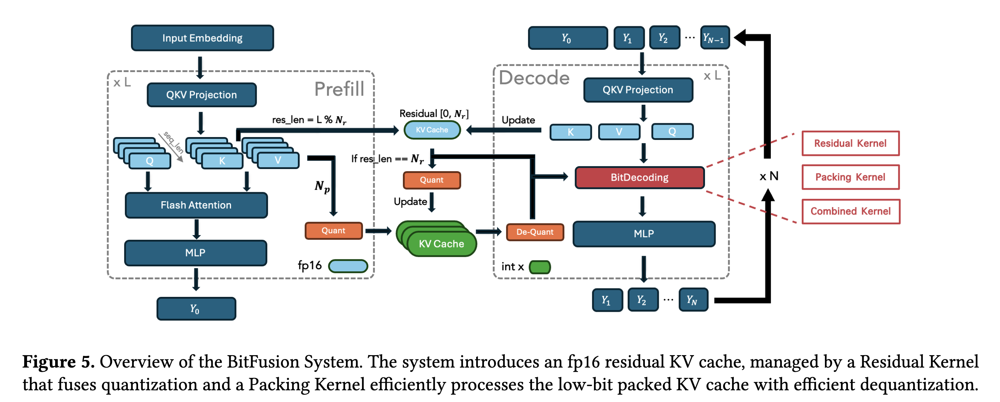
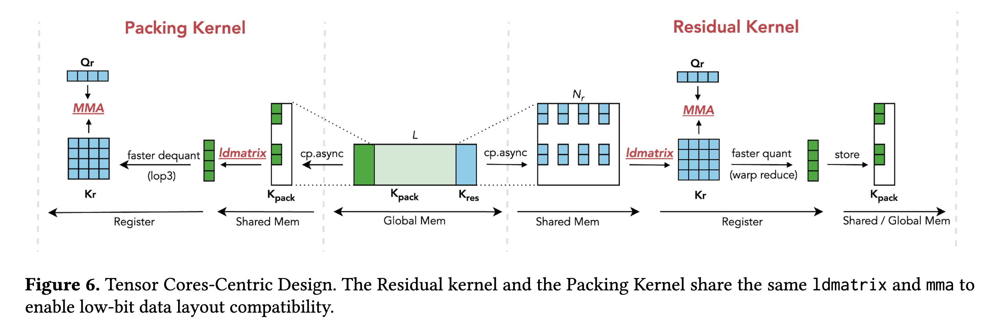
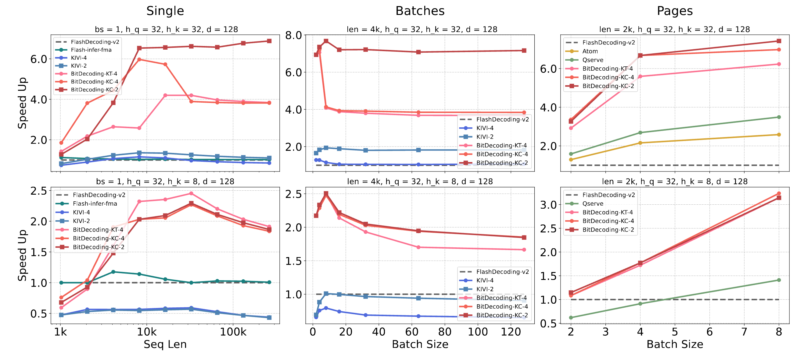
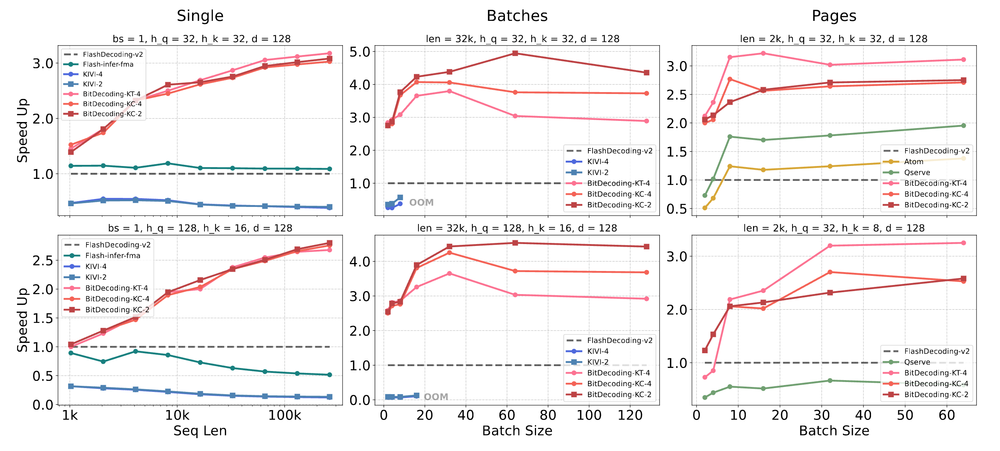

# BitDecoding
[](https://arxiv.org/abs/2503.18773)
[](LICENSE)

BitDecoding is a high-performance, GPU-optimized system
designed to accelerate long-context LLMs decoding with a low-bit KV
cache. Achieve **3-9x speedup** than Flash Attention v2.



## Benchmark
* Kernel Performance in RTX4090

* Kernel Performance in A100


## Installation
```
git clone --recursive https://github.com/DD-DuDa/BitDecoding.git
conda create -n bitdecode python=3.10
conda activate bitdecode
pip install -r requirements.txt
python setup.py install
```

## Quick Start
1. See benchmark/bench_single_decode.ipynb
2. (Optional) Play with libtorch c++      
    ```
    cd libs/
    wget https://download.pytorch.org/libtorch /cu124/libtorch-shared-with-deps-2.5.1%2Bcu124.zip
    unzip libtorch-shared-with-deps-2.5.1+cu124.zip
    rm libtorch-shared-with-deps-2.5.1+cu124.zip

    cd BitDecoding/csrc/bit_decode
    mkdir build && cd build
    cmake -DCMAKE_PREFIX_PATH=<libtorch_path> ..
    make -j12
    ```

## Release Progress

- [ ] Page Implementation
- [ ] Hopper Implementation
- [ ] End-2-end LLMs Inference

## Citation
If you find BitDecoding useful or want to use in your projects, please kindly cite our paper:
```
@misc{du2025bitdecodingunlockingtensorcores,
      title={BitDecoding: Unlocking Tensor Cores for Long-Context LLMs Decoding with Low-Bit KV Cache}, 
      author={Dayou Du and Shijie Cao and Jianyi Cheng and Ting Cao and Mao Yang},
      year={2025},
      eprint={2503.18773},
      archivePrefix={arXiv},
      primaryClass={cs.AR},
      url={https://arxiv.org/abs/2503.18773}, 
}
```

## Acknowledgement
BitDecoding is inspired by many open-source libraries, including (but not limited to) [flash-attention](https://github.com/Dao-AILab/flash-attention/tree/main), [flute](https://github.com/HanGuo97/flute), [Atom](https://github.com/efeslab/Atom), [omniserve](https://github.com/mit-han-lab/omniserve), [KIVI](https://github.com/jy-yuan/KIVI).
